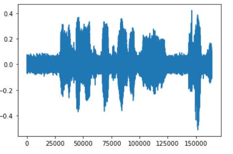
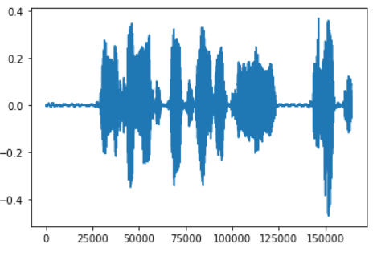
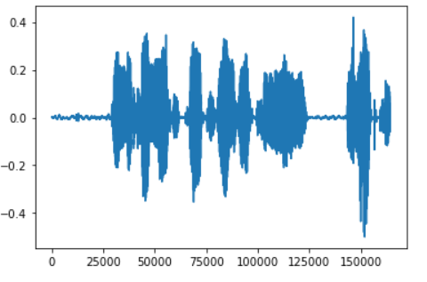
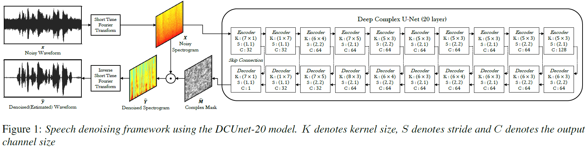
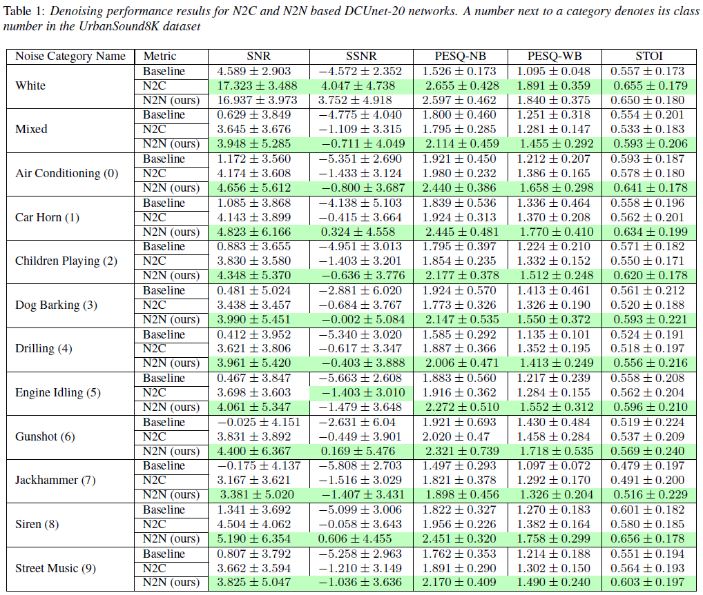

# Speech Denoising without Clean Training Data: a Noise2Noise Approach
Source code for the Interspeech 2021 paper titled "Speech Denoising without Clean Training Data: a Noise2Noise Approach". This paper removes the obstacle of heavy dependence of clean speech data required by deep learning based audio denoising methods, by showing that it is possible to train deep speech denoising networks using only noisy speech samples. Furthermore it is revealed that training regimes using only noisy audio targets achieve superior denoising performance over conventional training regimes utilizing clean training audio targets, in cases involving complex noise distributions and low Signal-to-Noise ratios (high noise environments). This is demonstrated through experiments studying the efficacy of our proposed approach over both real-world noises and synthetic noises using the 20 layered Deep Complex U-Net architecture. We aim to incentivise the collection of audio
data, even when the circumstances are not ideal to allow it to be perfectly clean. We believe that this could significantly advance the prospects of speech denoising technologies for various lowresource languages, due to the decreased costs and barriers in data collection.

## Research Paper and Citation
You can find the paper at the following link as part of the proceedings of Interspeech 2021: https://www.isca-speech.org/archive/interspeech_2021/kashyap21_interspeech.html . You can also view it on [Arxiv](https://arxiv.org/abs/2104.03838). 

If you would like to cite this work, please use the following Bibtex citation:

@inproceedings{kashyap21_interspeech,\
  author={Madhav Mahesh Kashyap and Anuj Tambwekar and Krishnamoorthy Manohara and S. Natarajan},\
  title={{Speech Denoising Without Clean Training Data: A Noise2Noise Approach}},\
  year=2021,\
  booktitle={Proc. Interspeech 2021},\
  pages={2716--2720},\
  doi={10.21437/Interspeech.2021-1130}\
}

## Python Requirements
We recommend using Python 3.8.8. The package versions are in requirements.txt. We recommend using the Conda package manager to install dependencies.
```
conda create --name <env> --file requirements.txt
```
If you get package errors creating the Conda environment, you can remove the packages from the requirement file and use pip install in the environment after its successful creation.

To be able to install pesq and pypesq you will need Microsoft C++ Build Tools [https://visualstudio.microsoft.com/visual-cpp-build-tools/](https://visualstudio.microsoft.com/visual-cpp-build-tools/), if you install Microsoft Visual Studio newer than 2019, it wouldn’t work.  

## Dataset Generation
We use 2 standard datasets; 'UrbanSound8K'(for real-world noise samples), and 'Voice Bank + DEMAND'(for speech samples). Please download the datasets from [urbansounddataset.weebly.com/urbansound8k.html](https://urbansounddataset.weebly.com/urbansound8k.html) and [datashare.ed.ac.uk/handle/10283/2791](https://datashare.ed.ac.uk/handle/10283/2791) respectively. Extract and organize into the Datasets folder as shown below:
```
Noise2Noise-audio_denoising_without_clean_training_data
│     README.md
│     speech_denoiser_DCUNet.ipynb
|     ...
│_____Datasets
      |     clean_testset_wav
      |     clean_trainset_28spk_wav
      |     noisy_testset_wav
      |     noisy_trainset_28spk_wav
      |_____UrbanSound8K
            |_____audio
                  |_____fold1
                  ...
                  |_____fold10

```

To train a White noise denoising model, run the script:
```
python white_noise_dataset_generator.py
```

To train a UrbanSound noise class denoising model, run the script, and select the noise class:
```
python urban_sound_noise_dataset_generator.py

0 : air_conditioner
1 : car_horn
2 : children_playing
3 : dog_bark
4 : drilling
5 : engine_idling
6 : gun_shot
7 : jackhammer
8 : siren
9 : street_music
```
The train and test datasets for the specified noise will be generated in the 'Datasets' directory.

## Training a New Model
In the 'speech_denoiser_DCUNet.ipynb' file. Specify the type of noise model you want to train to denoise(You have to generate the specific noise Dataset first). You can choose whether to train using our Noise2Noise approach(using noisy audio for both training inputs and targets), or the conventional approach(using noisy audio as training inputs and the clean audio as training target). If you are using Windows, set 'soundfile' as the torchaudio backend. If you are using Linux, set 'sox' as the torchaudio backend. The weights .pth file is saved for each training epoch in the 'Weights' directory.

## Testing Model Inference on Pretrained Weights
We have trained our model with both the Noise2Noise and Noise2Clean approaches, for all 10(numbered 0-9) UrbanSound noise classes and White Gaussian noise. All of our pre-trained model weights are uploaded in 'Pretrained_Weights' directory under the 'Noise2Noise' and 'Noise2Clean' subdirectories.

In the 'speech_denoiser_DCUNet.ipynb' file. Select the weights .pth file for model to use. Point to the testing folders containing the audio you want to denoise. Audio quality metrics will also be calculated. The noisy, clean and denoised wav files will be saved in the 'Samples' directory.

## Example
### Noisy audio waveform

### Model denoised audio waveform

### True clean audio waveform

## 20-Layered Deep Complex U-Net 20 Model Used

## Results


## Special thanks to the following repositories:
* https://github.com/pheepa/DCUnet
* https://github.com/ludlows/python-pesq
* https://github.com/mpariente/pystoi

## References
[1] Y. LeCun, Y. Bengio, and G. Hinton, “Deep learning,” Nature,
vol. 521, no. 7553, pp. 436–444, May 2015.

[2] J. Lehtinen, J. Munkberg, J. Hasselgren, S. Laine, T. Karras,
M. Aittala, and T. Aila, “Noise2Noise: Learning image restoration
without clean data,” in Proceedings of the 35th International
Conference on Machine Learning, 2018, pp. 2965–2974.

[3] N. Alamdari, A. Azarang, and N. Kehtarnavaz, “Improving
deep speech denoising by noisy2noisy signal mapping,” Applied
Acoustics, vol. 172, p. 107631, 2021.

[4] R. E. Zezario, T. Hussain, X. Lu, H. M.Wang, and Y. Tsao, “Selfsupervised
denoising autoencoder with linear regression decoder
for speech enhancement,” in ICASSP 2020 - 2020 IEEE International
Conference on Acoustics, Speech and Signal Processing
(ICASSP), 2020, pp. 6669–6673.

[5] Y. Shi, W. Rong, and N. Zheng, “Speech enhancement using convolutional
neural network with skip connections,” in 2018 11th
International Symposium on Chinese Spoken Language Processing
(ISCSLP), 2018, pp. 6–10.

[6] Z. Zhao, H. Liu, and T. Fingscheidt, “Convolutional neural networks
to enhance coded speech,” IEEE/ACM Transactions on Audio,
Speech, and Language Processing, vol. 27, no. 4, pp. 663–
678, 2019.

[7] F. G. Germain, Q. Chen, and V. Koltun, “Speech Denoising
with Deep Feature Losses,” in Proc. Interspeech 2019, 2019,
pp. 2723–2727. [Online]. Available: http://dx.doi.org/10.21437/
Interspeech.2019-1924

[8] A. Azarang and N. Kehtarnavaz, “A review of multi-objective
deep learning speech denoising methods,” Speech Communication,
vol. 122, 05 2020.

[9] C. Valentini-Botinhao, “Noisy speech database for training
speech enhancement algorithms and TTS models 2016[sound].”
[Online]. Available: https://doi.org/10.7488/ds/2117

[10] J. Salamon, C. Jacoby, and J. P. Bello, “A dataset and taxonomy
for urban sound research,” in 22nd ACM International Conference
on Multimedia (ACM-MM’14), Orlando, FL, USA, Nov. 2014, pp.
1041–1044.

[11] J. Robert, M. Webbie et al., “Pydub,” 2018. [Online]. Available:
http://pydub.com/

[12] H.-S. Choi, J.-H. Kim, J. Huh, A. Kim, J.-W. Ha, and K. Lee,
“Phase-aware speech enhancement with deep complex u-net,” in
International Conference on Learning Representations, 2018.

[13] O. Ronneberger, P. Fischer, and T. Brox, “U-net: Convolutional
networks for biomedical image segmentation,” in International
Conference on Medical image computing and computer-assisted
intervention. Springer, 2015, pp. 234–241.

[14] C. Veaux, J. Yamagishi, and S. King, “The voice bank corpus: Design,
collection and data analysis of a large regional accent speech
database,” in 2013 international conference oriental COCOSDA
held jointly with 2013 conference on Asian spoken language research
and evaluation (O-COCOSDA/CASLRE). IEEE, 2013,
pp. 1–4.

[15] J. Thiemann, N. Ito, and E. Vincent, “The diverse environments
multi-channel acoustic noise database (demand): A database of
multichannel environmental noise recordings,” in Proceedings of
Meetings on Acoustics ICA2013, vol. 19, no. 1. Acoustical Society
of America, 2013, p. 035081.

[16] C. Valentini-Botinhao, X. Wang, S. Takaki, and J. Yamagishi,
“Investigating rnn-based speech enhancement methods for noiserobust
text-to-speech.” in SSW, 2016, pp. 146–152.

[17] S. Kelkar, L. Grigsby, and J. Langsner, “An extension of parseval’s
theorem and its use in calculating transient energy in the
frequency domain,” IEEE Transactions on Industrial Electronics,
no. 1, pp. 42–45, 1983.

[18] C. Trabelsi, O. Bilaniuk, Y. Zhang, D. Serdyuk, S. Subramanian,
J. F. Santos, S. Mehri, N. Rostamzadeh, Y. Bengio, and C. J.
Pal, “Deep complex networks,” in 6th International Conference
on Learning Representations, ICLR 2018.

[19] B. Xu, N. Wang, T. Chen, and M. Li, “Empirical evaluation
of rectified activations in convolutional network,” arXiv preprint
arXiv:1505.00853, 2015.

[20] A. W. Rix, J. G. Beerends, M. P. Hollier, and A. P. Hekstra,
“Perceptual evaluation of speech quality (pesq)-a new method for
speech quality assessment of telephone networks and codecs,” in
2001 IEEE International Conference on Acoustics, Speech, and
Signal Processing. Proceedings (Cat. No.01CH37221), vol. 2,
2001, pp. 749–752 vol.2.

[21] C. H. Taal, R. C. Hendriks, R. Heusdens, and J. Jensen, “A shorttime
objective intelligibility measure for time-frequency weighted
noisy speech,” in 2010 IEEE International Conference on Acoustics,
Speech and Signal Processing, 2010, pp. 4214–4217.

[22] M. Zhou, T. Liu, Y. Li, D. Lin, E. Zhou, and T. Zhao, “Toward understanding
the importance of noise in training neural networks,”
in Proceedings of the 36th International Conference on Machine
Learning, ser. Proceedings of Machine Learning Research,
K. Chaudhuri and R. Salakhutdinov, Eds., vol. 97. PMLR, 09–15
Jun 2019, pp. 7594–7602.

[23] P. Ndajah, H. Kikuchi, M. Yukawa, H. Watanabe, and S. Muramatsu,
“An investigation on the quality of denoised images,” International
Journal of Circuits, Systems and Signal Processing,
vol. 5, no. 4, pp. 423–434, Oct. 2011.
